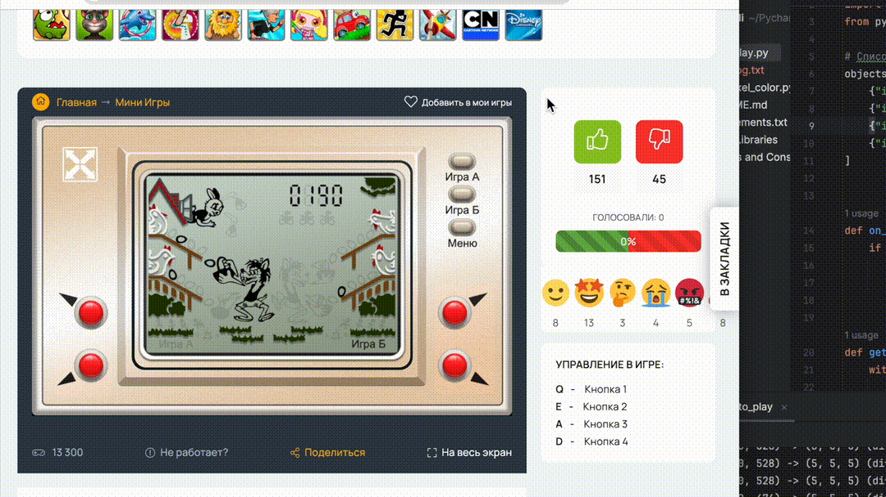

# 🎮 Автоматическое прохождение игры "Ловля яиц"

Скрипт автоматизирует игру, в которой нужно ловить яйца, реагируя на появление объектов в определённых местах экрана.

Алгоритм отслеживает изменения
цвета в указанных координатах и имитирует нажатие клавиш для управления корзиной.
## Демонстрация



## 📌 Возможности

<ul>
<li>Захват координат и цветов пикселей по клику мышки
</li>
<li>Автоматическая реакция на появление яйца (изменение цвета пикселя)
</li>
<li>Имитация управления игрой (нажатие нужной клавиши)
</li>

<li>Логирование координат для настройки</li>

</ul>

## 🚀 Как пользоваться

### Установка

1. Клонируйте репозиторий

```
git clone https://github.com/aleks-up/nu_pogodi.git
cd nu_pogodi
```

2. Создайте виртуальное окружение и установите зависимости:

```
python -m venv venv
venv\Scripts\activate      # для Windows  
source venv/bin/activate   # для macOS/Linux

```

3. Установите зависимости

```
pip install -r requirements.txt
```

### Запуск
#### Получение координат пикселей
- Запустите скрипт `python get_pixel_color.py`

  - При нажатии левой кнопки мыши сохраняются координаты и цвет пикселя под курсором.
  - При нажатии правой кнопки мыши программа завершает работу.
  - Все данные сохраняются в файл `click_log.`

- Настройте отслеживаемые объекты
  - Откройте файл `auto_play.py` и отредактируйте список `object`, добавив координаты и ожидаемые цвета из файла `click_log.txt`
- Запуск игры
  - Откройте игру
  - Запустите основной скрипт `python main.py`

>⚠️ Важно
> - Разрешение экрана и масштабирование могут повлиять на точность координат.
> - Убедитесь, что окно игры активно при запуске автоматизации.
